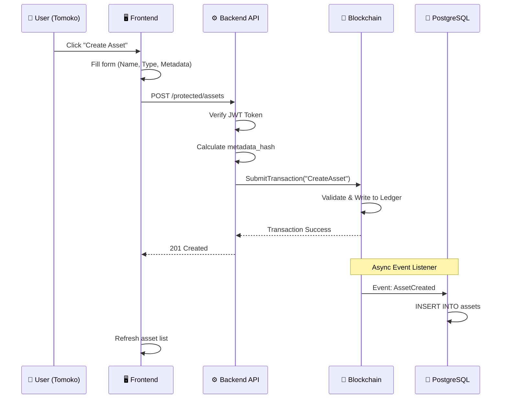
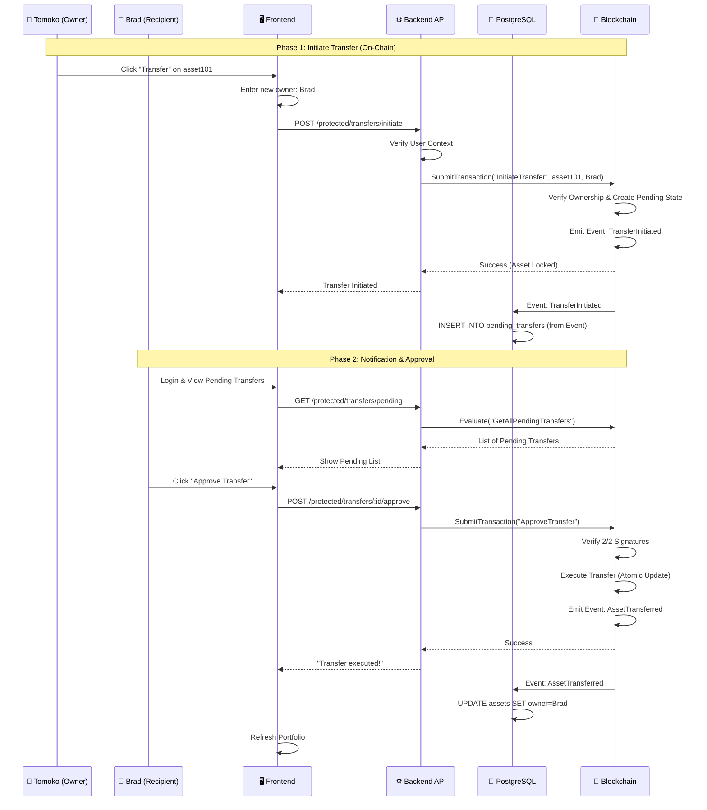
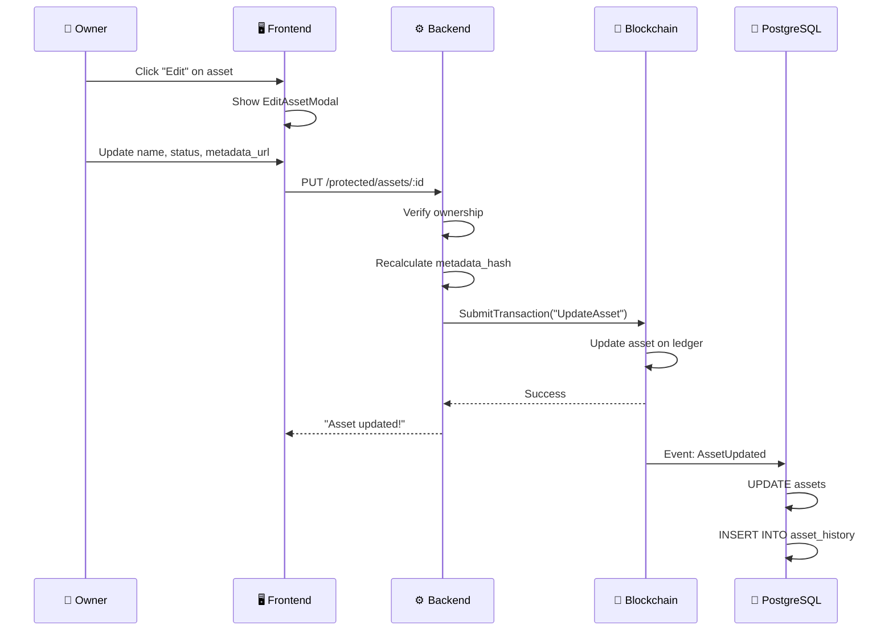
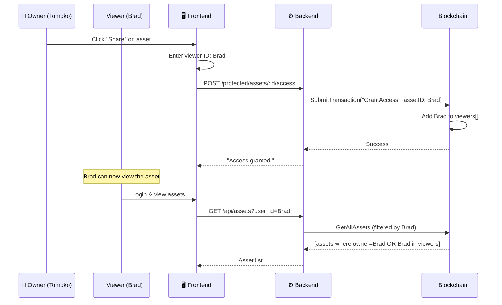
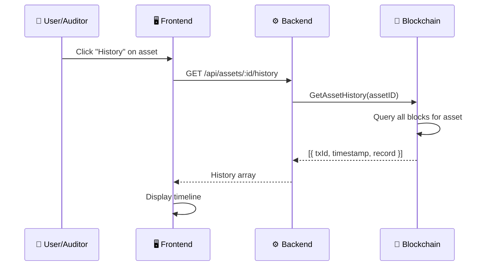
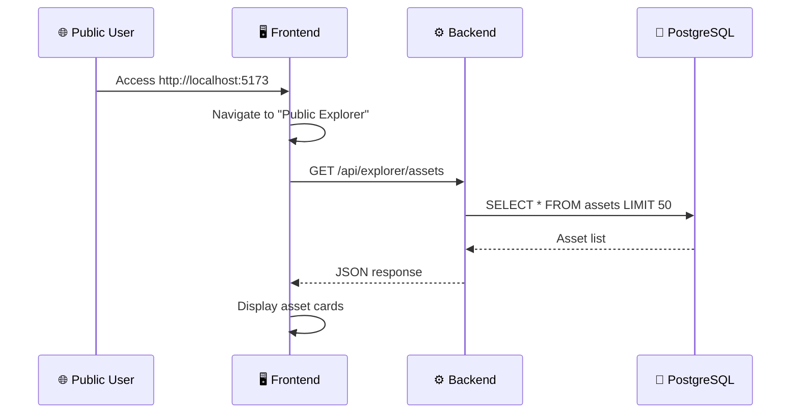
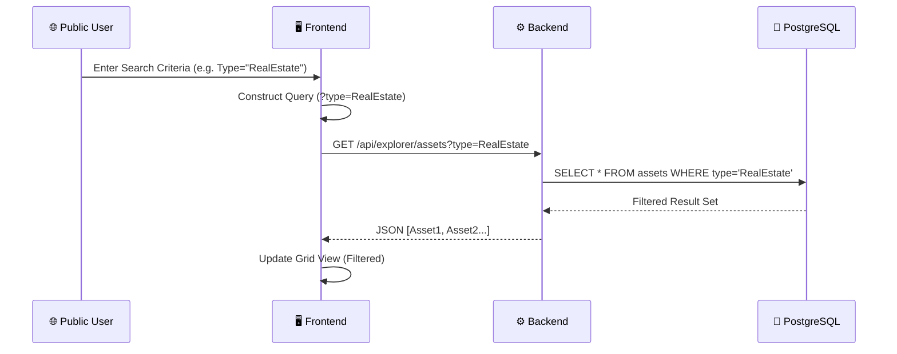

# AMS - Asset Management System (Hyperledger Fabric)

This project implements a private blockchain network using **Hyperledger Fabric v2.5** with the modern **Chaincode-as-a-Service (CCAAS)** deployment model.

## 🌟 Key Features

*   **Network Architecture**: 1 Organization, 3 Orderers (Raft Consensus), 3 Peers.
*   **Chaincode-as-a-Service (CCAAS)**: Chaincode runs as an independent Docker container, eliminating the dependency on Docker-in-Docker of the Peer, increasing stability and facilitating debugging.
*   **Automation**: Smart scripts automate the entire process from initializing the network, creating the channel, to deploying the chaincode.
*   **Asset Management**: Integrated chaincode for commercial asset management (ID, Name, Type, Owner, Status, Metadata).
*   **Multi-Signature Transfers**: Asset transfers require confirmation from both parties (sender + recipient) within 24 hours.
*   **Wallet-as-a-Service**: Register new users directly via API, automatically creating blockchain wallets.
*   **Admin & Security**: User locking capability, Admin Dashboard, and RBAC implementation. 

## 📂 Project Structure

```
ams/
├── backend/              # Backend API Service (Golang)
│   ├── fabric/           # SDK Client connecting to Ledger
│   ├── sync/             # Service syncing Ledger to SQL
│   └── main.go           # Entry point
├── frontend/             # Web Application (React + Vite + Tailwind)
│   ├── src/              # Source code components, pages, services
│   └── Dockerfile        # Docker configuration for Frontend
├── database/             # Off-chain Database (PostgreSQL)
│   └── schema.sql        # Table structure (Users, History...)
├── network/              # Core Hyperledger Fabric Network
│   ├── chaincode/        # Smart Contracts (Asset Transfer)
│   ├── docker/           # Docker Compose for Peers/Orderers/CAs
│   ├── network.sh        # Network lifecycle management script
│   ├── test_network.sh   # E2E testing script
│   └── configtx.yaml     # Channel configuration
├── scripts/              # Utility Scripts (Deploy, Create Channel...)
├── bin/                  # Fabric Binaries
├── config/               # Fabric Core Configs
├── builders/             # CCAAS External Builders
└── docker-compose-app.yaml # Orchestration for App (BE + FE + DB)
```

## 🚀 Quick Start Guide

### 1. Quick Start (Recommended)

We provide a specialized setup script that checks dependencies (Go, Docker, jq) and automatically downloads the necessary Hyperledger Fabric binaries.

```bash
# 1. Run the one-time setup script
./scripts/setup.sh

# 2. Start the system (Fresh Start)
sudo ./scripts/fresh_start.sh
```

**`fresh_start.sh`** will automatically:
1.  Clean up any old containers/networks.
2.  Start the Fabric Network (3 Orderers, 3 Peers).
3.  Deploy the Chaincode (CCAAS).
4.  Enroll Users & Create Wallets.
5.  Launch the App (Frontend + Backend + DB).
6.  Generate Sample Data.

### 2. Manual Installation


**Step 1: Clean up old system**
```bash
# At the root directory ams/
docker-compose -f docker-compose-app.yaml down --remove-orphans
docker system prune -f --volumes # Remove container and volume garbage

cd network
./network.sh down
cd ..

# Remove MSP artifacts (if needed)
sudo rm -rf network/organizations/fabric-ca/org1/msp network/organizations/fabric-ca/ordererOrg/msp
```

**Step 2: Start Fabric Network**
```bash
cd network
./network.sh up
./network.sh createChannel -c mychannel
```

**Step 3: Deploy Chaincode (CCAAS)**
```bash
./network.sh deployCC -ccn basic -ccp ./chaincode/asset-transfer -ccv 1.0 -ccs 1
cd ..
```

**Step 4: Register User Identities (Real Identity)**

Before launching the application, you need to register identities for real users to create Wallets used to sign transactions:
```bash
chmod +x scripts/enrollUser.sh

# Register sample users (Tomoko, Brad, JinSoo, Max...)
./scripts/enrollUser.sh Tomoko password
./scripts/enrollUser.sh Brad password
./scripts/enrollUser.sh JinSoo password
./scripts/enrollUser.sh Max password
./scripts/enrollUser.sh Adriana password
./scripts/enrollUser.sh Michel password
```

**Step 5: Launch Application (App)**
```bash
docker-compose -f docker-compose-app.yaml up -d --build
```

**Step 6: Initialize Database (Init Schema)**

Wait about 10s for the database container to fully start, then load the table structure:
```bash
sleep 10
docker exec -i ams-postgres psql -U ams_user -d ams_db < database/schema.sql
```

**Step 7: Create Sample Data**

Create sample assets for users:
```bash
./scripts/create_sample_data.sh
```

**Step 8: Create Test User with Password**

Create `demo_user` account to test login features:
```bash
sleep 3 # Wait for backend to be ready
curl -X POST http://localhost:3000/api/users \
  -H "Content-Type: application/json" \
  -d '{"id": "demo_user", "full_name": "Demo User", "identity_number": "DEMO001", "role": "User", "password": "demo123"}'
```

**Step 9: Sync Users from Blockchain to PostgreSQL**

Sync all users from Ledger to Off-chain database:
```bash
./scripts/sync_users.sh
```

**Step 10: Set Passwords for All Users**

Add passwords for the registered users:
```bash
./scripts/add_passwords.sh
```

**Step 11: Check Access**

*   **Frontend**: [http://localhost:5173](http://localhost:5173)
*   **Backend Health**: [http://localhost:3000/api/health](http://localhost:3000/api/health)
*   **Public Explorer**: [http://localhost:3000/api/explorer/assets](http://localhost:3000/api/explorer/assets)

**Step 12: Test Login**

```bash
# Test JWT Authentication
curl -X POST http://localhost:3000/api/auth/login \
  -H 'Content-Type: application/json' \
  -d '{"username":"Tomoko","password":"tomoko123"}'

# Test Query Assets
curl "http://localhost:3000/api/assets?user_id=Tomoko"
```

#### 🔐 Login Information

After completing Fresh Start, you can log in with the following accounts:

| Username | Password | Role | Wallet |
|----------|----------|------|--------|
| `demo_user` | `demo123` | User | ✓ |
| `Tomoko` | `tomoko123` | User | ✓ |
| `Brad` | `brad123` | User | ✓ |
| `JinSoo` | `jinsoo123` | User | ✓ |
| `Max` | `max123` | User | ✓ |
| `Adriana` | `adriana123` | User | ✓ |
| `Michel` | `michel123` | User | ✓ |
| `admin` | `admin123` | Admin | ✓ |
| `auditor` | `auditor123` | Auditor | ✓ |
| `user01` | `user01123` | User | ✓ |

#### 🆕 Register New User (Via API - WaaS)

You can also register new users directly via API:

```bash
curl -X POST http://localhost:3000/api/wallet/register \
  -H "Content-Type: application/json" \
  -d '{"username": "NewUser", "password": "password", "full_name": "New User", "identity_number": "ID-NEW"}'
```

## 🔄 Transaction Flows

### 1️⃣ **Create Asset**

**Description**: User creates a new asset on the blockchain.



**API Endpoint**: `POST /api/protected/assets`

**Request Body**:
```json
{
  "ID": "asset101",
  "name": "Luxury Penthouse",
  "type": "RealEstate",
  "metadata_url": "https://ipfs.io/ipfs/Qm..."
}
```

**Result**:
- ✅ Asset written to blockchain
- ✅ Metadata hash automatically calculated
- ✅ Owner set as creator
- ✅ Synced to PostgreSQL via event listener

---

### 2️⃣ **Transfer Asset - Multi-Signature**

**Description**: Asset transfer requires confirmation from **2 parties** (sender + recipient) within **24 hours**.



**Timeline**:
- **T+0**: Tomoko initiates → Auto-approved (1/2)
- **T+1 min to 24h**: Brad approves → Executes immediately ✅
- **T+24h**: Expires if not approved ❌

**API Endpoints**:
1. `POST /api/protected/transfers/initiate` - Initiate
2. `GET /api/protected/transfers/pending` - View pending
3. `POST /api/protected/transfers/:id/approve` - Approve
4. `POST /api/protected/transfers/:id/reject` - Reject

**Database Tables**:
```sql
pending_transfers (
  id, asset_id, current_owner, new_owner, 
  status, created_at, expires_at
)

transfer_signatures (
  pending_transfer_id, signer_id, signer_role,
  action, signed_at
)
```

---

### 3️⃣ **Update Asset**

**Description**: Owner or Admin can update asset information.



**Editable Fields**:
- ✅ `name` - Asset name
- ✅ `status` - Status (Available, Locked, Under Maintenance)
- ✅ `metadata_url` - Metadata URL (auto-recalculates hash)

**Immutable Fields**:
- ❌ `ID` - Cannot participate
- ❌ `type` - Cannot change
- ❌ `owner` - Only changes via Transfer

---

### 4️⃣ **Grant Access**

**Description**: Allow other users to view private assets.



**Access Control**:
- `viewers: []` - Private (owner only)
- `viewers: ["Brad"]` - Brad can view
- `viewers: ["EVERYONE"]` - Public

---

### 5️⃣ **View History**

**Description**: View entire asset mutation history from blockchain.



**History Record**:
```json
{
  "tx_id": "abc123...",
  "timestamp": "2025-12-20T08:00:00Z",
  "is_delete": false,
  "record": {
    "ID": "asset101",
    "name": "Luxury Penthouse",
    "owner": "Tomoko",
    "status": "Available"
  }
}
```

---

### 6️⃣ **Public Explorer**

**Description**: View all public assets from PostgreSQL (no login required).



**Features**:
- ✅ No authentication required
- ✅ Search by name, owner, type
- ✅ View transaction history
- ✅ Real-time updates (synced from blockchain)

---

### 7️⃣ **Search Assets (Filtered)**

**Description**: Users filter public assets using specific criteria (Name, Owner, Type).



**Filters Supported**:
- ✅ **Name**: Partial match (ILIKE)
- ✅ **Owner**: Exact match
- ✅ **Type**: Exact match (RealEstate, Art, Vehicle)

---

### 📊 **Transaction Summary Table**

| Operation | Endpoint | Auth | Multi-Sig | Blockchain | Database |
|-----------|----------|------|-----------|------------|----------|
| Create Asset | `POST /protected/assets` | ✅ | ❌ | ✅ Write | ✅ Sync |
| Transfer Asset | `POST /protected/transfers/initiate` | ✅ | ✅ 2/2 | ✅ Write | ✅ Pending |
| Approve Transfer | `POST /protected/transfers/:id/approve` | ✅ | ✅ | ✅ Execute | ✅ Update |
| Update Asset | `PUT /protected/assets/:id` | ✅ | ❌ | ✅ Write | ✅ Sync |
| Grant Access | `POST /protected/assets/:id/access` | ✅ | ❌ | ✅ Write | ❌ |
| View History | `GET /api/assets/:id/history` | ❌ | ❌ | ✅ Read | ❌ |
| Explorer | `GET /api/explorer/assets` | ❌ | ❌ | ❌ | ✅ Read |

---

## System Design Spec (Expanded)

Below is the data model specification for upcoming versions:

### 1. Users & Organizations
Managing participants (Owners, Regulators, Notaries).

*   **Users**
    *   `user_id` (PK): Unique ID.
    *   `full_name`: Full Name.
    *   `identity_number`: Citizen ID/Passport.
    *   `wallet_address`: Blockchain Wallet Address.
    *   `role_id` (FK): Role Link.

*   **Roles**
    *   `role_id` (PK): Admin, Owner, Validator, etc.

### 2. Assets
Assets can be Real Estate, Vehicles, or Art.

*   **Assets**
    *   `asset_id` (PK): Asset ID.
    *   `asset_type`: Land, Vehicle, Art.
    *   `metadata_url`: Link to detailed file (JSON Off-chain).
    *   `metadata_hash`: SHA-256 Hash of metadata file (Integrity Check).
    *   `current_owner_id` (FK): Link to Users.
    *   `status`: Active, Pending Transfer, Frozen.
    *   `blockchain_tx_hash`: Creation Transaction Hash.

### 3. Transactions
Storage of ownership history and attestations.

*   **Transactions**
    *   `tx_id` (PK): Transaction ID.
    *   `asset_id` (FK): Asset.
    *   `from_user_id` (FK): Seller/Sender.
    *   `to_user_id` (FK): Buyer/Receiver.
    *   `validator_id` (FK): Approval agency.
    *   `timestamp`: Time of execution.
    *   `blockchain_status`: Pending, Confirmed, Failed.

### 4. Access Control & Security
Hybrid **RBAC** (Role-Based) and **ABAC** (Attribute-Based).

*   **Role-Based:**
    *   `Admin`: View **all** assets/transactions.
    *   `Owner`: View, Transfer, Grant Access to owned assets.
    *   `Auditor`: View transaction history for compliance.
    *   `Viewer`: Granted access to specific assets.

*   **Attribute-Based:**
    *   Each asset has `viewers`: List of UserIDs.
    *   **Private by Default**: Only Owner sees newly created assets.

### 5. Asset Provenance
Full lifecycle history (Chain of Custody).

*   **History Records**:
    *   Contains `TxID`, `Timestamp`, `Asset State Snapshot`.

### 6. Data Strategy (On-chain vs Off-chain)

| Data Type | Storage | Details | Reason |
| :--- | :--- | :--- | :--- |
| **Identity & State** | **On-chain** | `asset_id`, `docType`, `owner`, `status` | Required for Chaincode Validation Logic. |
| **Access Control** | **On-chain** | `viewers` (Array) | Controls World State Read access. |
| **Integrity Proof** | **On-chain** | `metadata_hash` (SHA-256) | Ensures Off-chain data is not tampered with. |
| **Tx History** | **On-chain** | `tx_id`, `timestamp`, `history` | Provenance and Audit. |
| **Details** | **Off-chain** | Images, Videos, PDFs | Reduces Ledger load. |

### 7. Why `metadata_hash`?

**Q: Why store Hash On-chain when we have the URL?**
**A:** Data Integrity.
*   **Problem:** Data at `metadata_url` (Off-chain) can be silently modified.
*   **Solution:** `metadata_hash` acts as an immutable digital fingerprint on Blockchain.

### 8. Development Roadmap

Core modules are completed (MVP Completed):

#### **Phase 1: Backend API Gateway (Golang) ✅ Completed**
*   **Goal**: Secure RESTful API.
*   **Functions**: `GET /api/assets`, `POST /api/assets/:id/access`, `GET /api/assets/:id/history`.

#### **Phase 2: Frontend Web App ✅ Completed**
*   **Goal**: Intuitive UI.
*   **Functions**: Login Flow, Dashboard, Transfer, Sharing, History.

#### **Phase 3: Hybrid Architecture ✅ Completed**
*   **Goal**: Query Performance & Advanced Search.
*   **Implementation**: CouchDB (On-chain), PostgreSQL (Off-chain), Sync Service (Block Listener), Read-Write Split.

#### **Phase 4: Real Identity & Wallet Integration (WaaS) ✅ Completed**
*   **Goal**: X.509 Identity & WaaS.
*   **Implementation**: Fabric CA integration, Automated Registration, Dynamic Identity per Request.

#### **Phase 5: Authentication System ✅ Completed**
*   **Goal**: Security & Session Management.
*   **Implementation**: Bcrypt Hashing, JWT Authentication, Secure Endpoints (`/protected`), secure Login API.

#### **Phase 6: On-Chain Multi-Sig Architecture ✅ Completed**
*   **Goal**: On-chain Multi-Sig Logic.
*   **Implementation**: On-chain State Management, Atomic Execution, Event-Driven UI.

#### **Phase 7: Admin & Security Features ✅ Completed**
*   **Goal**: Robust Administration & Security.
*   **Features**:
    *   **User Locking (On-Chain)**: Admin can lock/unlock users directly on Ledger.
    *   **Admin Dashboard**: Dedicated monitoring interface.
    *   **Real-time Sync**: User status synced immediately.
    *   *Documentation*: See [docs/ADMIN_GUIDE.md](docs/ADMIN_GUIDE.md).

#### **Phase 8: Future Works (Planned)**
*   **Goal**: Scaling & New Features.
*   **Planned Features**:
    *   **Dashboard Analytics**: Advanced data visualization.
    *   **Network Expansion**: Multi-organization setup.
    *   **IPFS Integration**: ✅ Completed (Decentralized storage for asset metadata).
    *   **Composite Key Status**: Refactor user locking to use composite keys (`status~userID`) for better concurrency at scale.

---

## 🛠️ Helper Scripts

*   `scripts/fresh_start.sh`: Automate Reset & Re-deploy.
*   `scripts/create_sample_data.sh`: Create sample assets.

---

## 📚 Documentation

For more specific details, please refer to the documents in the `docs/` folder:

*   **[System Architecture](docs/ARCHITECTURE.md)**: Technical details on Network, Backend, Frontend, and Database.
*   **[Operations Guide](docs/OPERATIONS.md)**: Admin guide, scripts, and user account management.
*   **[Features & Workflows](docs/FEATURES.md)**: Transaction flows, wallet services, and multi-sig logic.

For finding old document versions, check `docs/archive/`.

 
