# Admin Asset Lock Data Flow

This document details the data flow when an Administrator locks an asset in the AMS system.

## Sequence Diagram

```mermaid
sequenceDiagram
    participant Admin as 👤 Admin (Browser)
    participant FE as 🖥️ Frontend (React)
    participant API as ⚙️ Backend API
    participant FAB as 🔗 Fabric Gateway
    participant CC as 📜 Chaincode
    participant EVT as 👂 Event Listener
    participant DB as 🗄️ Postgres DB

    Note over Admin, FE: 1. User Clicks Lock Icon

    Admin->>FE: Click Lock Button
    FE->>FE: Optimistic Update (Status = "Locked")
    FE->>API: POST /api/protected/admin/assets/:id/lock
    
    Note over API: Verifies Admin JWT Role

    API->>FAB: SubmitTransaction("LockAsset", ID)
    FAB->>CC: Invoke LockAsset()
    
    Note over CC: Checks: <br/>1. Caller is Admin<br/>2. Asset Exists

    CC->>CC: Set Status = "Locked"
    CC->>CC: Emit Event "AssetLocked"
    CC-->>FAB: Success (Updated Asset JSON)
    FAB-->>API: Transaction Committed
    API-->>FE: 200 OK { message: "Locked" }

    par Async Event Processing
        CC->>EVT: Event: "AssetLocked"
        EVT->>DB: UPDATE assets SET status='Locked' WHERE id=...
        Note over EVT, DB: Syncs specific field changes
    and Frontend Refresh with Delay
        FE->>FE: Wait 2.0s (Allow Sync time)
        FE->>API: GET /api/explorer/assets
        API->>DB: SELECT * FROM assets
        DB-->>API: Return Updated List
        API-->>FE: Updated Asset List
        FE->>Admin: Update UI with Source of Truth
    end
```

## detailed Steps

1.  **Initiation**: The Admin clicks the lock icon on an asset in the "Asset Audit" view.
2.  **Optimistic UI**: The Frontend immediately updates the local state to show the asset as "Locked" to provide instant feedback.
3.  **API Call**: The Frontend sends a authenticated `POST` request to the backend.
4.  **Blockchain Transaction**: The Backend authenticates the user as an Admin and submits a `LockAsset` transaction to the Hyperledger Fabric network.
5.  **Chaincode Execution**: The smart contract verifies the Admin identity, updates the asset status on the ledger, and emits a `AssetLocked` event.
6.  **Event Sync**: The Backend's Event Listener catches the event and asynchronously updates the PostgreSQL read-model.
7.  **Data Refresh**: After a short delay (to allow for the async sync), the Frontend re-fetches the asset list from the database to ensure the displayed data matches the persistent state.
