# System Transaction Flows

This document details the execution flows for key operations in the Asset Management System, visualized using Mermaid sequence diagrams.

## 📋 Table of Contents

1.  [NFT Marketplace: Buy Asset](#1-nft-marketplace-buy-asset-flow)
2.  [Create Asset](#2-create-asset)
3.  [Transfer Asset (Multi-Sig)](#3-transfer-asset---multi-signature)
4.  [Update Asset](#4-update-asset)
5.  [Grant Access](#5-grant-access)
6.  [View History](#6-view-history)
7.  [Public Explorer](#7-public-explorer)
8.  [Search Assets](#8-search-assets-filtered)

---

### 1. NFT Marketplace: Buy Asset Flow

**Description**: The precise sequence of events when a user purchases an asset from the marketplace. This operation is **atomic**, meaning the financial transaction (Credits transfer) and asset ownership transfer happen simultaneously within the same block transaction.

---

### 2. Create Asset

**Description**: User creates a new asset on the blockchain.

```mermaid
sequenceDiagram
    participant User as 👤 User (Tomoko)
    participant Frontend as 🖥️ Frontend
    participant Backend as ⚙️ Backend API
    participant Fabric as 🔗 Blockchain
    participant DB as 💾 PostgreSQL

    User->>Frontend: Click "Create Asset"
    Frontend->>Frontend: Fill form (Name, Type, Metadata)
    Frontend->>Backend: POST /protected/assets
    Backend->>Backend: Verify JWT Token
    Backend->>Backend: Calculate metadata_hash
    Backend->>Fabric: SubmitTransaction("CreateAsset")
    Fabric->>Fabric: Validate & Write to Ledger
    Fabric-->>Backend: Transaction Success
    Backend-->>Frontend: 201 Created
    
    Note over Fabric,DB: Async Event Listener
    Fabric->>DB: Event: AssetCreated
    DB->>DB: INSERT INTO assets
    Frontend->>Frontend: Refresh asset list
```

---

### 3. Transfer Asset - Multi-Signature

**Description**: Asset transfer requires confirmation from **2 parties** (sender + recipient) within **24 hours**.

```mermaid
sequenceDiagram
    participant Tomoko as 👤 Tomoko (Owner)
    participant Brad as 👤 Brad (Recipient)
    participant Frontend as 🖥️ Frontend
    participant Backend as ⚙️ Backend API
    participant DB as 💾 PostgreSQL
    participant Fabric as 🔗 Blockchain

    Note over Tomoko,Fabric: Phase 1: Initiate Transfer (On-Chain)
    Tomoko->>Frontend: Click "Transfer" on asset101
    Frontend->>Frontend: Enter new owner: Brad
    Frontend->>Backend: POST /protected/transfers/initiate
    Backend->>Backend: Verify User Context
    Backend->>Fabric: SubmitTransaction("InitiateTransfer", asset101, Brad)
    Fabric->>Fabric: Verify Ownership & Create Pending State
    Fabric->>Fabric: Emit Event: TransferInitiated
    Fabric-->>Backend: Success (Asset Locked)
    
    Backend-->>Frontend: Transfer Initiated
    
    Fabric->>DB: Event: TransferInitiated
    DB->>DB: INSERT INTO pending_transfers (from Event)

    Note over Brad,Fabric: Phase 2: Notification & Approval
    Brad->>Frontend: Login & View Pending Transfers
    Frontend->>Backend: GET /protected/transfers/pending
    Backend->>Fabric: Evaluate("GetAllPendingTransfers")
    Fabric-->>Backend: List of Pending Transfers
    Backend-->>Frontend: Show Pending List
    
    Brad->>Frontend: Click "Approve Transfer"
    Frontend->>Backend: POST /protected/transfers/:id/approve
    Backend->>Fabric: SubmitTransaction("ApproveTransfer")
    Fabric->>Fabric: Verify 2/2 Signatures
    Fabric->>Fabric: Execute Transfer (Atomic Update)
    Fabric->>Fabric: Emit Event: AssetTransferred
    Fabric-->>Backend: Success
    
    Backend-->>Frontend: "Transfer executed!"
    
    Fabric->>DB: Event: AssetTransferred
    DB->>DB: UPDATE assets SET owner=Brad
    Frontend->>Frontend: Refresh Portfolio
```

**Timeline**:
- **T+0**: Tomoko initiates → Auto-approved (1/2)
- **T+1 min to 24h**: Brad approves → Executes immediately ✅
- **T+24h**: Expires if not approved ❌

---

### 4. Update Asset

**Description**: Owner or Admin can update asset information (Name, Status, Metadata).

```mermaid
sequenceDiagram
    participant User as 👤 Owner
    participant Frontend as 🖥️ Frontend
    participant Backend as ⚙️ Backend
    participant Fabric as 🔗 Blockchain
    participant DB as 💾 PostgreSQL

    User->>Frontend: Click "Edit" on asset
    Frontend->>Frontend: Show EditAssetModal
    User->>Frontend: Update name, status, metadata_url
    Frontend->>Backend: PUT /protected/assets/:id
    Backend->>Backend: Verify ownership
    Backend->>Backend: Recalculate metadata_hash
    Backend->>Fabric: SubmitTransaction("UpdateAsset")
    Fabric->>Fabric: Update asset on ledger
    Fabric-->>Backend: Success
    Backend-->>Frontend: "Asset updated!"
    
    Fabric->>DB: Event: AssetUpdated
    DB->>DB: UPDATE assets
    DB->>DB: INSERT INTO asset_history
```

---

### 5. Grant Access

**Description**: Allow other users to view private assets.

```mermaid
sequenceDiagram
    participant Owner as 👤 Owner (Tomoko)
    participant Viewer as 👤 Viewer (Brad)
    participant Frontend as 🖥️ Frontend
    participant Backend as ⚙️ Backend
    participant Fabric as 🔗 Blockchain

    Owner->>Frontend: Click "Share" on asset
    Frontend->>Frontend: Enter viewer ID: Brad
    Frontend->>Backend: POST /protected/assets/:id/access
    Backend->>Fabric: SubmitTransaction("GrantAccess", assetID, Brad)
    Fabric->>Fabric: Add Brad to viewers[]
    Fabric-->>Backend: Success
    Backend-->>Frontend: "Access granted!"
    
    Note over Viewer: Brad can now view the asset
    Viewer->>Frontend: Login & view assets
    Frontend->>Backend: GET /api/assets?user_id=Brad
    Backend->>Fabric: GetAllAssets (filtered by Brad)
    Fabric-->>Backend: [assets where owner=Brad OR Brad in viewers]
    Backend-->>Frontend: Asset list
```

---

### 6. View History

**Description**: View entire asset mutation history from blockchain.

---

### 7. Public Explorer

**Description**: View all public assets from PostgreSQL (no login required).

```mermaid
sequenceDiagram
    participant Public as 🌐 Public User
    participant Frontend as 🖥️ Frontend
    participant Backend as ⚙️ Backend
    participant DB as 💾 PostgreSQL

    Public->>Frontend: Access http://localhost:5173
    Frontend->>Frontend: Navigate to "Public Explorer"
    Frontend->>Backend: GET /api/explorer/assets
    Backend->>DB: SELECT * FROM assets LIMIT 50
    DB-->>Backend: Asset list
    Backend-->>Frontend: JSON response
    Frontend->>Frontend: Display asset cards
```

---

### 8. Search Assets (Filtered)

**Description**: Users filter public assets using specific criteria (Name, Owner, Type).

```mermaid
sequenceDiagram
    participant Public as 🌐 Public User
    participant Frontend as 🖥️ Frontend
    participant Backend as ⚙️ Backend
    participant DB as 💾 PostgreSQL

    Public->>Frontend: Enter Search Criteria (e.g. Type="RealEstate")
    Frontend->>Frontend: Construct Query (?type=RealEstate)
    Frontend->>Backend: GET /api/explorer/assets?type=RealEstate
    Backend->>DB: SELECT * FROM assets WHERE type='RealEstate'
    DB-->>Backend: Filtered Result Set
    Backend-->>Frontend: JSON [Asset1, Asset2...]
    Frontend->>Frontend: Update Grid View (Filtered)
```

